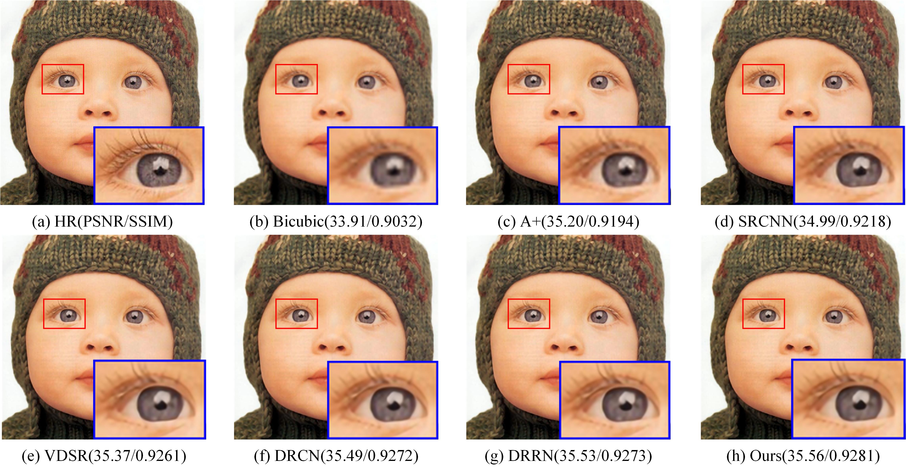

# PyTorch Ours
we implements our model in PyTorch

## Usage
### Training
```
usage: main.py [-h] [--batchSize BATCHSIZE] [--nEpochs NEPOCHS] [--lr LR]
               [--step STEP] [--cuda] [--resume RESUME]
               [--start-epoch START_EPOCH] [--clip CLIP] [--threads THREADS]
               [--momentum MOMENTUM] [--weight-decay WEIGHT_DECAY]
               [--pretrained PRETRAINED]
               
optional arguments:
  -h, --help            Show this help message and exit
  --batchSize           Training batch size
  --nEpochs             Number of epochs to train for
  --lr                  Learning rate. Default=0.01
  --step                Learning rate decay, Default: n=10 epochs
  --cuda                Use cuda
  --resume              Path to checkpoint
  --clip                Clipping Gradients. Default=0.4
  --threads             Number of threads for data loader to use Default=1
  --momentum            Momentum, Default: 0.9
  --weight-decay        Weight decay, Default: 1e-4
  --pretrained PRETRAINED
                        path to pretrained model (default: none)
```

### Evaluation
```
usage: eval.py [-h] [--cuda] [--model MODEL] [--dataset DATASET]
               [--scale SCALE]

PyTorch Eval

optional arguments:
  -h, --help         show this help message and exit
  --cuda             use cuda?
  --model MODEL      model path
  --dataset DATASET  dataset name, Default: Set5
```
An example of training usage is shown as follows:
```
python eval.py --cuda
```

### Demo
```
usage: demo.py [-h] [--cuda] [--model MODEL] [--image IMAGE] [--scale SCALE]
               
optional arguments:
  -h, --help            Show this help message and exit
  --cuda                Use cuda
  --model               Model path. Default=model/model_epoch_50.pth
  --image               Image name. Default=butterfly_GT
  --scale               Scale factor, Default: 4
```

### Prepare Training dataset
  - We provide a simple hdf5 format training sample in data folder with 'data' and 'label' keys, the training data is generated with Matlab Bicubic Interplotation, please refer .m file in data for creating training files.

### Performance
  - Performance in PSNR on Set5
  
| Scale        | Our method          |
| ------------- |:-------------:|
| 2x      | 37.78      |
| 3x      | 34.05      |
| 4x      | 31.69      |

### Result
From left to right are ground truth, bicubic and ours
<p>
  
</p>
